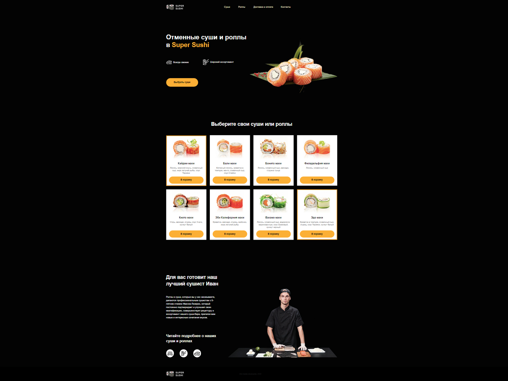

# Одностраничный сайт (лендинг) суши-бара

Самостоятельно выполненный проект в рамках обучения на курсе "Профессия Frontend-Разработчик" в онлайн-школе "Айтилогия".

## Внешний вид

## Выполненные задачи:
- Создание статического одностраничного сайта по макету;
- Практика применения CSS-стилей, CSS-псевдоклассов.

## Используемые технологии:
* HTML
* CSS